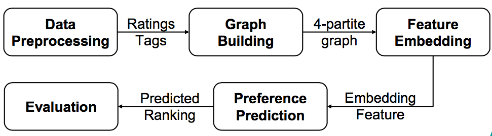

# Recommendation-system with semi-metapath2vec

## Overview
Recommendation system utilize the information between item-item, user-user and user-item. To express the relationship among those pairs, graph is a great tool. This project evaluate the difference between different graph structures and embedding methods. Also, we modify the metapath2vec and create another algorithm named semi-metapath2vec. We finally can produce the rank of items for each user and it achieve really good results.

## Implementation  
   

 *  The implementation details are in the [report](https://ez2o.co/2WxmS).
 
## Installation
 *  Download the dataset from [here](http://snap.stanford.edu/data/amazon-meta.html). Unzip it and put the 'amazon-meta.txt' in the corpus directory.
 *  For the first time, you can just run `make all` to do the preprocessing, toy example extract, build graph and test the embedding algorithm.
 *  For running different embedding method, you need to pay attention on different graph type (rebuild it by `make build_graph` if you need that).  

You can also take a look at makefile to see some detail argument for each step. We provide some description below:  
#### 1. preprocessing:  
Preprocess the original dataset from txt. No arguments needed.  

#### 2. toy_exxtractor:  
Extract the toy dataset from original dataset.  
Arguments:  
 -  user_num : the number of user you want to focus on  
 -  product_range : only extrac the user who rate number is in this range.   

#### 3. build_graph:  
Building the graph from the toy_example.  
Arguments:  
 -  graph_name : the name of output graph.  
 -  graph_type : 'w' for the graph with preference part in the graph, 'w/o' for the graph without preference part in the graph.  
 -  pref_type : if graph_type is 'w', 'dense' for the dense preference part, 'sparse' for the sparse preference part.  

For other detail use instruction, please check the code and makefile.  

## Conclusions
 * Based on our experiments, comparing to the commonly used centroid graph, the four-partite graph improves the performance a lot.
 * For algorithm, although PPR has better performance on the small scale dataset, the memory bottleneck makes it a impractical method in reality. Semi-metapath2vec has higher scalability.
 * Due to data sparsity, most of the items in the subset we analyze are only connected to one single user. As a result, when only considering the relation between items, we get the best performance.
 * Different regressors have different properties. To summarize, random forest regressor would be extraordinary at the situation that only partial features are important; while support vector regressor performs well in most of time except that embedding dimensions are too big.
 * We could treat HIN fusion function as linear regression with ensemble and non-linear activation function.

 ## Reference  
 
* Wayne Xin Zhao Chuan Shi, Binbin Hu and Philip S. Yu. 2017. Heterogeneous Information Network Embedding for Recommendation. Expert Systems with Applications (2017).
* Aditya Grover and Jure Leskovec. 2016. node2vec: Scalable Feature Learning for Networks. In Proceedings of the 22nd ACM SIGKDD International Conference on Knowledge Discovery and DataMining(KDD’16)(2016).
* Larry Page and Sergey Brin. 1998. The PageRank Citation Ranking: Bringing Order to the Web. (1998).
*  Bita Shams and Saman Haratizadeh. 2017. Graph-based collab- orative ranking. Expert Systems with Applications (2017).
*  Paul W. Cuf Shang Shang, Sanjeev R. Kulkarni. 2012. A ran- domwalk based model incorporating social information for rec- ommendations. Machine Learning for Signal Processing (MLSP) (2012).
*  Ananthram Swami. Yuxiao Dong, Nitesh V. Chawla. 2017. meta- path2vec: Scalable Representation Learning for Heterogeneous Networks. In Proceedings of the 23rd ACM SIGKDD Interna- tional Conference on Knowledge Discovery and Data Mining (KDD ’17) (2017).

 

